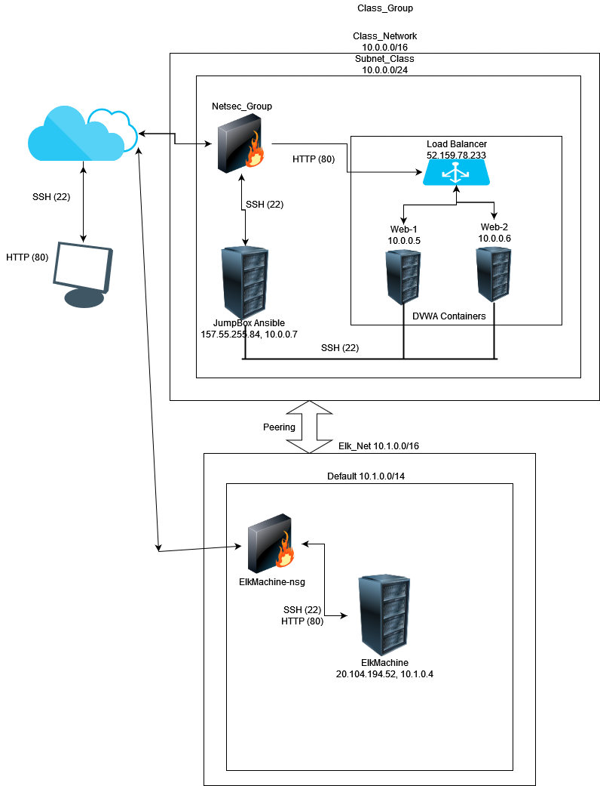
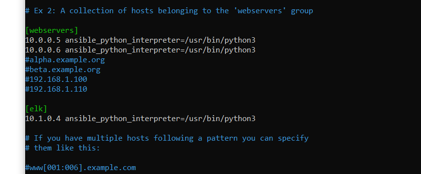

## Automated ELK Stack Deployment

The files in this repository were used to configure the network depicted below.

These files have been tested and used to generate a live ELK deployment on Azure. They can be used to either recreate the entire deployment pictured above. Alternatively, select portions of the playbook file may be used to install only certain pieces of it, such as Filebeat.

- [filebeat-playbook.yml](https://github.com/TCGill2004/Elk-Stack-Project/blob/main/YML%20files/filebeat-playbook.yml)
- [install-elk.yml](https://github.com/TCGill2004/Elk-Stack-Project/blob/main/YML%20files/install-elk.yml)
- [metricbeat-playbook.yml](https://github.com/TCGill2004/Elk-Stack-Project/blob/main/YML%20files/metricbeat-playbook.yml)
- [pentest.yml](https://github.com/TCGill2004/Elk-Stack-Project/blob/main/YML%20files/pentest.yml)

This document contains the following details:
- Description of the Topologu
- Access Policies
- ELK Configuration
  - Beats in Use
  - Machines Being Monitored
- How to Use the Ansible Build

### Description of the Topology

The main purpose of this network is to expose a load-balanced and monitored instance of DVWA, the D*mn Vulnerable Web Application.

Load balancing ensures that the application will be highly available, in addition to restricting inbound access to the network.  Load balancing ensures the availability of the web services by splitting the web traffic between the web servers in such a way as to prevent any one server from being completely overwhelmed.  This can also help protect the web servers from DDOS attacks.  A jumpbox is a secure machine that is never accessed or used for any non-administrative task.  A jumpbox protects the network by ensuring that all port 22 traffic is routed through a single harded and heavily monitored point of access.

Integrating an ELK server allows users to easily monitor the vulnerable VMs for changes to the log files and system metrics.
- Filebeat monitors log files and log events on the web servers and forwards them to the Elk server.
- Metricbeat collects activity and traffic data on the web servers and forwards this data to the Elk server

The configuration details of each machine may be found below.

| Name       | Function   | IP Address             | Operating System |
|------------|------------|------------------------|------------------|
| JumpBox    | Gateway    | 10.0.0.7 157.55.255.84 | Ubuntu 20.04     |
| Web-1      | Web Server | 10.0.0.5               | Ubuntu 20.04     |
| Web-2      | Web Server | 10.0.0.6               | Ubuntu 20.04     |
| ElkMachine | Monitoring | 10.1.0.4 20.104.194.52 | Ubuntu 20.04     |

### Access Policies

The machines on the internal network are not exposed to the public Internet. 

Only the Jump Box machine can accept connections from the Internet via port 22. Access to this machine is only allowed from the following IP addresses:
- 104.222.75.207

Machines within the network can only be accessed via SSH through the Jump Box.  The web servers can only be accessed through port 22 via the whitelisted IP address of 10.0.0.7.

A summary of the access policies in place can be found in the table below.

| Name       | Publicly Accessible? | Allowed IP Addresses |
|------------|----------------------|----------------------|
| JumpBox    | Yes                  | 104.222.75.207       |
| Web-1      | No                   | 10.0.0.7             |
| Web-2      | No                   | 10.0.0.7             |
| ElkMachine | Yes                  | 104.222.75.207       |

### Elk Configuration

Ansible was used to automate configuration of the ELK machine. No configuration was performed manually, which is advantageous because it allows the Elk machine to be quickly copied or redeployed without the need to manually configure each and every machine.  YAML playbooks also have the advantage of being easily human readable and can be quickly modified and redeployed should the Elk machines ever need to be reconfigured.

The playbook implements the following tasks:
- Installs Docker
- Installs Python3-pip
- Installs Docker pip module
- Increases virtual memory
- Downloads and launches Docker Elk container
- Enables service Docker on boot

The following screenshot displays the result of running `docker ps` after successfully configuring the ELK instance.

### Target Machines & Beats
This ELK server is configured to monitor the following machines:
- Web-1 10.0.0.5
- Web-2 10.0.0.6

We have installed the following Beats on these machines:
- Filebeat
- Metricbeat

These Beats allow us to collect the following information from each machine:
- ***Filebeat*** collects log events and forwards them to the Elk server.  This allows you to easily monitor any administrative actions taken on the webserver.
- ***Metricbeat*** collects resource usage and system health data and forwards them to the Elk server.  Metricbeat provides overall system monitoring that makes it easy to determine whether or not the hardware resources are adequate to the overall traffic and services use for each web server being monitored.

### Using the Playbook
In order to use the playbook, you will need to have an Ansible control node already configured. Assuming you have such a control node provisioned: 

SSH into the control node and follow the steps below:
- Copy the configuration file to /etc/ansible.
- Update the [hosts file](hosts.yml) to include the IP address of the target machine(s) as well as the appropriate user credentials.
- Run the playbook, and navigate to (Public_IP):5601/app/kibana to check that the installation worked as expected. 

***FAQ:***
- _Which file is the playbook? Where do you copy it?_

The [install-elk.yml](https://github.com/TCGill2004/Elk-Stack-Project/blob/main/YML%20files/install-elk.yml) YAML file contains an ansible playbook which will automatically install and configure the Elk server.  The playbook file should be copied to /etc/ansible in an Ansible control node in order to work correctly.
- _Which file do you update to make Ansible run the playbook on a specific machine? How do I specify which machine to install the ELK server on versus which to install Filebeat on?_

Use the [hosts.yml](hosts.yml) template to assign machines on your network to groups according to their designated function.  Webservers should be assigned to the "webservers" group and the machine that will serve as your Elk server should be assigned to the "lk" group.  Machines can be added to groups by simply entering their IP address under the appropriate header followed by 'ansible_python_interpreter=/usr/bin/python3'.  This will ensure Python support for every machine on your network.  Your completed hosts.yml file should look something like this:

- _Which URL do you navigate to in order to check that the ELK server is running?_

Navigate to (Public_IP):5601/app/kibana in order to confirm that your Elk Server is running.  If everything is working properly, your browser should display the following web page:

